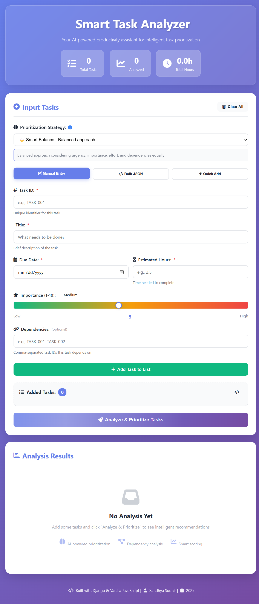

# 🎯 Smart Task Analyzer

### 🚀 Your AI-Powered Productivity Sidekick

**Intelligently prioritize tasks using multiple AI strategies** 🧠  
*Never wonder "What should I work on next?" ever again!*

[🎥 View Demo](#-demo) • [⚡ Quick Start](#-quick-start) • [📖 Documentation](#-how-it-works) • [🤝 Contribute](#-contributing)

---

## 🌟 What Makes This Special?

<table>
<tr>
<td width="50%">

### 🎯 Smart Prioritization
Uses 4 different strategies to analyze tasks based on **urgency**, **importance**, **effort**, and **dependencies**

</td>
<td width="50%">

### ⚡ Lightning Fast
Built with Django REST Framework for blazing-fast API responses in milliseconds

</td>
</tr>
<tr>
<td width="50%">

### 🎨 Beautiful UI
Modern, responsive design with smooth animations and glassmorphism effects

</td>
<td width="50%">

### 🔗 Dependency-Aware
Automatically detects circular dependencies and prioritizes blocking tasks

</td>
</tr>
</table>

---

## 🎥 Demo

### 📸 Application Screenshots

*Smart Task Analyzer in action - Add tasks and watch the AI prioritize them!*

  

<table>
<tr>
<td width="50%">

<b>🎯 Input Tasks</b> Multiple input methods

</td>
<td width="50%">

<b>📊 Analysis Results</b> Priority scores & explanations

</td>
</tr>
</table>

---

## ✨ Features That'll Blow Your Mind

🧠 AI-Powered Algorithms → Smart prioritization using multiple factors
⚖️ 4 Priority Strategies → Choose what matters most to you
⚡ Quick Add Mode → Rapid task entry with smart defaults
📊 Visual Priority Scores → Color-coded badges and explanations
🔗 Dependency Detection → Finds circular dependencies automatically
📥 Bulk JSON Import → Upload tasks in seconds
💾 Export Results → Download analysis as JSON
🎨 Modern UI/UX → Smooth animations & responsive design
⌨️ Keyboard Shortcuts → Ctrl+Enter to analyze, Ctrl+K to clear
🌈 Dark Mode Support → Easy on the eyes (coming soon!)

text

---

## 🚀 Quick Start

### Prerequisites

✅ Python 3.8 or higher
✅ pip package manager
✅ Modern web browser (Chrome, Firefox, Edge)

text

### 🎬 Action! Let's Get Started

**1️⃣ Clone the Repository**

git clone https://github.com/YOUR_USERNAME/smart-task-analyzer.git
cd smart-task-analyzer

text

**2️⃣ Backend Setup (Django)**

cd backend

Create virtual environment
python -m venv venv

Activate it
Windows:
venv\Scripts\activate

Mac/Linux:
source venv/bin/activate

Install dependencies
pip install -r requirements.txt

Run migrations
python manage.py migrate

Start server
python manage.py runserver

text

**3️⃣ Frontend Setup**

Open new terminal
cd frontend

Option 1: Double-click index.html
Option 2: Use Live Server in VS Code
Option 3: Python simple server
python -m http.server 8080

text

**4️⃣ Open Your Browser**

Navigate to `http://localhost:8080` (or open `index.html`)

**Backend API:** `http://127.0.0.1:8000`

---

## 📖 How It Works

### 🧮 The Algorithm

The Smart Task Analyzer calculates a **priority score (0-10)** for each task based on four weighted factors:

#### 1️⃣ Urgency Score (Due Date Analysis)

🚨 Past due → 10.0 (Maximum urgency!)
⏰ Due today → 9.5
📅 Due in 1-3 days → 9.0
📆 Due in 4-7 days → 7.0
📊 Due in 8-14 days → 5.0
📈 Due in 15-30 days → 3.0
🗓️ Due after 30 days → 1.0

text

#### 2️⃣ Importance Score

Direct user input (1-10 scale) reflecting business value or impact

#### 3️⃣ Effort Score (Inverse Priority)

⚡ ≤ 1 hour → 10.0 (Quick wins!)
🏃 1-3 hours → 8.0
🚶 3-5 hours → 6.0
🐢 5-8 hours → 4.0
🐌 > 8 hours → 2.0

text

#### 4️⃣ Dependency Score

Tasks blocking others get **+2.5 points** per dependent (capped at 10)

### 🎯 Prioritization Strategies

<table>
<tr>
<td width="25%">

**⚖️ Smart Balance**

(Urgency × 0.3) +
(Importance × 0.3) +
(Effort × 0.2) +
(Dependency × 0.2)

text

Balanced approach

</td>
<td width="25%">

**⚡ Fastest Wins**

(Effort × 0.5) +
(Urgency × 0.3) +
(Importance × 0.2)

text

Quick momentum

</td>
<td width="25%">

**🎯 High Impact**

(Importance × 0.5) +
(Dependency × 0.3) +
(Urgency × 0.2)

text

Maximum value

</td>
<td width="25%">

**⏰ Deadline Driven**

(Urgency × 0.6) +
(Importance × 0.3) +
(Dependency × 0.1)

text

Time pressure

</td>
</tr>
</table>

### 🔍 Circular Dependency Detection

Uses **Depth-First Search (DFS)** with recursion stack:

def has_cycle(task_id, visited, rec_stack):
visited.add(task_id)
rec_stack.add(task_id)

text
for dependency in task.dependencies:
    if dependency in rec_stack:
        return True  # 🚨 Cycle detected!

rec_stack.remove(task_id)
return False
text

---

## 🛠️ Tech Stack

### Backend 🔙

| Technology | Purpose | Version |
|:----------:|:-------:|:-------:|
|  **Python** | Core Language | 3.8+ |
|  **Django** | Web Framework | 5.2.8 |
| **DRF** | REST API | Latest |
|  **SQLite** | Database | Default |

### Frontend 🎨

| Technology | Purpose |
|:----------:|:-------:|
|  **HTML5** | Structure |
|  **CSS3** | Styling + Animations |
|  **Vanilla JS** | Interactivity |
| **Fetch API** | Async Requests |
| **Font Awesome** | Icons |

---

## 🧪 Testing

Run the comprehensive test suite:

cd backend
python manage.py test

text

**Test Coverage:**
- ✅ Past-due task prioritization
- ✅ Circular dependency detection
- ✅ Invalid data handling
- ✅ Empty task list validation

Found 4 test(s).
Creating test database...
....
Ran 4 tests in 0.025s

OK ✅

text

---

## 📁 Project Structure

smart-task-analyzer/
│
├── 📂 backend/ # Django REST API
│ ├── 📂 task_analyzer/ # Project settings
│ │ ├── ⚙️ settings.py
│ │ ├── 🌐 urls.py
│ │ └── 🚀 wsgi.py
│ ├── 📂 tasks/ # Main app
│ │ ├── 🗄️ models.py # Task model
│ │ ├── 🧮 scoring.py # Priority algorithm
│ │ ├── 📊 serializers.py # Data validation
│ │ ├── 👁️ views.py # API endpoints
│ │ └── 🧪 tests.py # Unit tests
│ ├── 🔧 manage.py
│ └── 📦 requirements.txt
│
├── 📂 frontend/ # Web interface
│ ├── 🌐 index.html # Main page
│ ├── 🎨 style.css # Styling
│ └── ⚡ script.js # Client logic
│
├── 📂 screenshots/ # Demo images
├── 📄 README.md # You are here!
├── 🚫 .gitignore
└── 📜 LICENSE

text

---

## 🎯 API Endpoints

### 🔥 Analyze Tasks

POST /api/tasks/analyze/
Content-Type: application/json

{
"tasks": [
{
"task_id": "TASK-001",
"title": "Fix critical bug",
"due_date": "2025-11-28",
"estimated_hours": 2,
"importance": 10,
"dependencies": []
}
],
"strategy": "smart_balance"
}

text

**Response:**
{
"tasks": [...],
"strategy": "smart_balance",
"total_tasks": 1
}

text

### ⭐ Suggest Top Tasks

POST /api/tasks/suggest/

text

Returns top 3 recommended tasks

### ❤️ Health Check

GET /api/tasks/health/

text

---

## 🎓 Design Decisions & Trade-offs

### ✅ Why Django REST Framework?

- 🚀 Fast development with built-in features
- 🔒 Robust validation and serialization
- 📚 Excellent documentation
- 🌐 Easy CORS handling

### ✅ Why Vanilla JavaScript?

- 📦 No build tools or dependencies
- ⚡ Lightweight and blazing fast
- 💪 Demonstrates core JS skills
- 🚀 Easy deployment anywhere

### ⚠️ Trade-offs

| Choice | Benefit | Trade-off |
|--------|---------|-----------|
| Linear scoring | Simple & predictable | Doesn't capture complex interactions |
| Fixed weights | Consistent results | Not user-customizable (yet!) |
| SQLite | Zero config | Not for production scale |
| Vanilla JS | No dependencies | More code for complex features |

---

## 💡 Future Enhancements

- [ ] 🔐 User authentication & accounts
- [ ] 💾 Persistent task storage
- [ ] 📊 Dependency graph visualization
- [ ] 📅 Google Calendar integration
- [ ] 🤖 ML-based priority learning
- [ ] 📱 Mobile app (React Native)
- [ ] 👥 Team collaboration features
- [ ] ⏱️ Time tracking & analytics
- [ ] 🔄 Recurring task support
- [ ] 📑 PDF/CSV export
- [ ] 🌙 Dark mode
- [ ] 🌍 Internationalization

---

## 🤝 Contributing

Contributions are welcome! Here's how:

1. 🍴 Fork the repository
2. 🌿 Create a feature branch (`git checkout -b feature/AmazingFeature`)
3. 💾 Commit your changes (`git commit -m 'Add some AmazingFeature'`)
4. 📤 Push to the branch (`git push origin feature/AmazingFeature`)
5. 🎉 Open a Pull Request

---

## 📜 License

This project is licensed under the MIT License - see the [LICENSE](LICENSE) file for details.

---

## 👨‍💻 Author

**Sandhya Sudhir**

B.Tech Student | Full-Stack Developer | Problem Solver

---

## 🙏 Acknowledgments

- **Singularium Technologies Pvt Ltd** for the amazing internship opportunity
- **Django Community** for the excellent framework
- **Font Awesome** for beautiful icons
- **You** for checking out this project! ⭐

---

## 📊 Project Stats

---

### ⭐ Star this repo if you found it helpful!

**Made with ❤️ and lots of ☕ by Sandhya Sudhir**

*Happy Task Managing! 🎯*

Step 4: Create LICENSE File
Create LICENSE:

text
MIT License

Copyright (c) 2025 Sandhya Sudhir

Permission is hereby granted, free of charge, to any person obtaining a copy
of this software and associated documentation files (the "Software"), to deal
in the Software without restriction, including without limitation the rights
to use, copy, modify, merge, publish, distribute, sublicense, and/or sell
copies of the Software, and to permit persons to whom the Software is
furnished to do so, subject to the following conditions:

The above copyright notice and this permission notice shall be included in all
copies or substantial portions of the Software.

THE SOFTWARE IS PROVIDED "AS IS", WITHOUT WARRANTY OF ANY KIND, EXPRESS OR
IMPLIED, INCLUDING BUT NOT LIMITED TO THE WARRANTIES OF MERCHANTABILITY,
FITNESS FOR A PARTICULAR PURPOSE AND NONINFRINGEMENT. IN NO EVENT SHALL THE
AUTHORS OR COPYRIGHT HOLDERS BE LIABLE FOR ANY CLAIM, DAMAGES OR OTHER
LIABILITY, WHETHER IN AN ACTION OF CONTRACT, TORT OR OTHERWISE, ARISING FROM,
OUT OF OR IN CONNECTION WITH THE SOFTWARE OR THE USE OR OTHER DEALINGS IN THE
SOFTWARE.
Step 5: Create requirements.txt
In backend/requirements.txt:

text
Django==5.2.8
djangorestframework==3.14.0
django-cors-headers==4.3.1
Step 6: Add Screenshots
Take screenshots of your application and save them in screenshots/ folder:

main-interface.png - Full view of your app

input-section.png - Task input area

analysis-results.png - Results display

Step 7: Initialize Git & Push to GitHub
bash
# Navigate to project root
cd C:\Users\asus\OneDrive\Desktop\Canteen\task-analyzer

# Initialize Git
git init

# Add all files
git add .

# Commit
git commit -m "🎉 Initial commit: Smart Task Analyzer - AI-powered task prioritization system

✨ Features:
- 4 intelligent prioritization strategies
- Circular dependency detection
- Beautiful responsive UI with animations
- REST API with Django
- Comprehensive test suite
- Multiple input methods (Form, JSON, Quick Add)

🛠️ Tech Stack: Django 5.2.8, Python 3.8+, Vanilla JavaScript, HTML5, CSS3

📝 Assignment for Singularium Technologies Pvt Ltd"

# Create GitHub repository (go to github.com and create new repo)
# Then link it:
git remote add origin https://github.com/YOUR_USERNAME/smart-task-analyzer.git

# Push to GitHub
git branch -M main
git push -u origin main